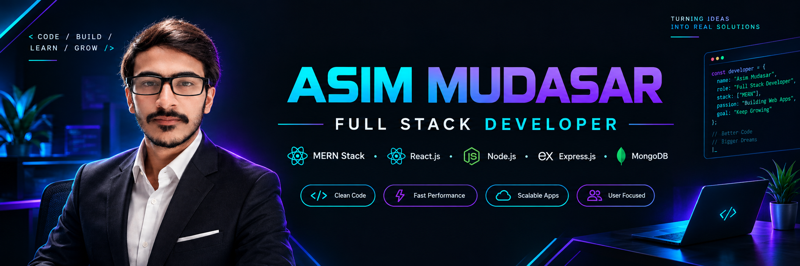

<div align="center">



</div>

<br/>


<div align="center">


<br/>


<br/><br/>

<a href="https://github.com/asimmudassar541-ship-it">

</a>

<a href="https://linkedin.com/in/asim-mudassar-72a62a384">

</a>

</div>

---


## 🖥️ SYSTEM.INFO

```text
╭──────────────────────────────────────────────────────────────╮
│                                                              │
│   > INITIALIZING ASIM.DEV                                    │
│   > SYSTEM STATUS: ONLINE                                    │
│                                                              │
├──────────────────────────────────────────────────────────────┤
│                                                              │
│   IDENTITY                                                   │
│   ├── NAME       : Asim Mudasar                              │
│   ├── ROLE       : Full Stack Web Developer                  │
│   ├── SPECIALTY  : MERN Stack                                │
│   └── LOCATION   : Pakistan                                  │
│                                                              │
│   FRONTEND                                                   │
│   ├── React.js                                               │
│   ├── JavaScript                                             │
│   ├── HTML5                                                  │
│   ├── CSS3                                                   │
│   └── Bootstrap                                              │
│                                                              │
│   BACKEND                                                    │
│   ├── Node.js                                                │
│   ├── Express.js                                             │
│   ├── REST APIs                                              │
│   └── JWT Authentication                                     │
│                                                              │
│   DATABASE                                                   │
│   └── MongoDB                                                │
│                                                              │
│   DEVELOPMENT TOOLS                                          │
│   ├── Git                                                    │
│   ├── GitHub                                                 │
│   ├── VS Code                                                │
│   ├── npm                                                    │
│   └── Postman                                                │
│                                                              │
│   STATUS                                                     │
│   ├── BUILDING                                               │
│   ├── LEARNING                                               │
│   └── SHIPPING                                               │
│                                                              │
╰──────────────────────────────────────────────────────────────╯


```


---

## 👨‍💻 ABOUT ME

Hi, I'm **Asim Mudasar**, a Full Stack Web Developer focused on building modern, responsive and database-driven web applications.

I enjoy turning ideas into working products using the **MERN Stack** and continuously improving my development skills through real-world projects.

- 🚀 Building full-stack web applications
- ⚛️ Working with React.js
- 🟢 Developing backend APIs with Node.js & Express.js
- 🍃 Working with MongoDB
- 🔐 Working with authentication and REST APIs
- 📚 Continuously learning modern web technologies
- 💡 Interested in scalable and user-friendly applications

---

## ⚡ TECH STACK

<div align="center">

### 🎨 FRONTEND


<br><br>

### ⚙️ BACKEND


<br><br>

### 🗄️ DATABASE


<br><br>

### 🛠️ TOOLS


<br><br>

### 🔐 DEVELOPMENT


</div>

---

## 🚀 FEATURED PROJECTS

<table>
<tr>
<td width="50%">

### 🏦 Bank Management System

A full-stack banking management application built with the MERN stack.

**Tech:**  
`React` `Node.js` `Express` `MongoDB`

</td>

<td width="50%">

### 💰 Royal Finance

A finance-focused web application for managing financial information and user data.

**Tech:**  
`JavaScript` `React` `Node.js` `MongoDB`

</td>
</tr>

<tr>
<td width="50%">

### 🍔 Food Ordering Website

A modern food ordering platform with frontend and backend functionality.

**Tech:**  
`MERN` `REST API` `MongoDB`

</td>

<td width="50%">

### 🛒 E-Commerce Website

A full-stack e-commerce application focused on products, users and online shopping functionality.

**Tech:**  
`React` `Express` `MongoDB`

</td>
</tr>
</table>

---


## 📊 GITHUB ANALYTICS

<div align="center">


</div>

---

## 🏆 GITHUB TROPHIES

<div align="center">



</div>


---

## 🔥 CONTRIBUTION STREAK

<div align="center">


</div>

---

## 📈 CONTRIBUTION GRAPH

<div align="center">


</div>

---

## 🧠 CURRENT FOCUS

<div align="center">

| 🚀 Area | 🎯 Current Focus |
|---|---|
| ⚛️ React.js | Building modern and reusable UI components |
| 🟢 Node.js | Developing scalable backend applications |
| 🚀 Express.js | Building REST APIs |
| 🍃 MongoDB | Database design and data management |
| 🔐 Authentication | JWT authentication and secure APIs |
| ☁️ DevOps | Learning cloud deployment and DevOps practices |

</div>

---

## 🎯 2026 GOALS

<div align="center">

| 🎯 Goal | 📌 Progress |
|---|---|
| 🚀 Build production-ready full-stack applications | 🔄 In Progress |
| ⚛️ Improve advanced React.js skills | 🔄 In Progress |
| 🟢 Improve backend architecture & API design | 🔄 In Progress |
| 🗄️ Strengthen database design skills | 🔄 In Progress |
| ☁️ Learn Cloud & DevOps | 🔄 In Progress |
| 🐳 Learn Docker & CI/CD | 📚 Learning |
| 🌍 Contribute to Open Source | 🎯 Planned |
| 💼 Grow as a professional Full Stack Developer | 🚀 Ongoing |

</div>

---

## 🔗 Professional Links

<div align="center">

<a href="https://github.com/asimmudassar541-ship-it"></a>&nbsp;&nbsp;&nbsp;&nbsp;
<a href="https://linkedin.com/in/asim-mudassar-72a62a384"></a>&nbsp;&nbsp;&nbsp;&nbsp;
<a href="https://asim-portfolio-green.vercel.app/"></a>
<br>

### 💬 Open to learning, collaboration & new opportunities

</div>

---

<div align="center">


<br><br>

### ⚡ Thanks for visiting my profile!

`Building • Learning • Shipping`

<br>

⭐ Feel free to Contact me.

</div>
